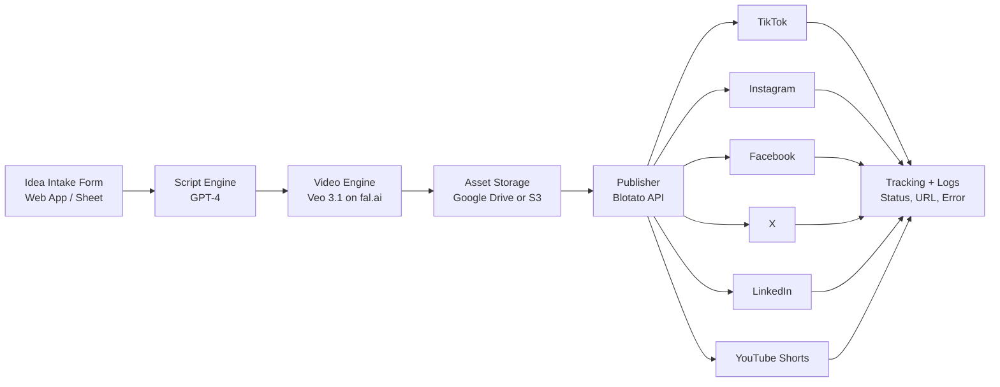

# 💥 AI Video Factory
### Turn ideas into published short-form videos automatically

Build a business-ready pipeline that takes ideas from a sheet, generates videos with AI, and publishes to every major platform.

---

## 🚀 Best way to use this for your business

If you want this as a **URL or app**, use this rollout path:

### **Option 1 (Recommended): Web App + Backend Automation**
- Build a simple web app (your branded URL) where your team submits ideas.
- The backend writes rows into Google Sheets (or database queue).
- n8n/Make/Zapier workflow runs generation + publishing.
- Dashboard shows status, links, and failures.

✅ Best for agencies, teams, and scalable operations.

### Option 2: Internal Ops Portal (Fastest MVP)
- Keep Google Sheets as UI.
- Add AppSheet/Retool/Glide as a front-end URL.
- Team enters ideas in forms instead of directly editing sheets.

✅ Best for launching quickly with low engineering effort.

### Option 3: Full SaaS Product
- Replace Sheets with DB (Postgres/Firebase).
- Add auth, billing, role-based access, usage limits, analytics.
- Multi-tenant architecture for client accounts.

✅ Best for productizing and monetizing.

---

## 🧠 Workflow UI

---

## ⚙️ What this automation does
1. Reads new idea records
2. Writes story + shot narrative with GPT-4
3. Generates cinematic video via Veo 3.1 using 3 reference images
4. Uploads final asset to Drive/S3
5. Publishes to all selected platforms via Blotato
6. Writes back URL + status (`Completed` / `Failed`)

---

## 🧩 Business setup

### Required accounts
- OpenAI API key (GPT-4)
- fal.ai API key (Veo 3.1)
- Google Cloud (Sheets + Drive)
- Blotato API key
- Optional: AWS S3 + CloudFront (if you want branded asset URLs)

### Google Sheet schema (if using Sheets)
| Column | Field | Purpose |
|---|---|---|
| A | `id_video` | Unique ID |
| B | `niche` | Business category |
| C | `idea` | Content idea |
| D | `url_1` | Ref image 1 |
| E | `url_2` | Ref image 2 |
| F | `url_3` | Ref image 3 |
| G | `url_final` | Final video URL |
| H | `status` | Completed / Failed |

---

## 🌐 How to launch as a URL (practical blueprint)

### Frontend
- Next.js, Webflow, or Bubble
- Pages:
  - `/submit` → idea form
  - `/jobs` → video queue + status
  - `/assets` → generated video library

### Backend
- API endpoint `/api/create-video`
- Saves request to queue (Sheets/DB)
- Triggers automation webhook (n8n/Make)

### Automation layer
- Webhook trigger
- GPT prompt node
- Veo 3.1 node/API call
- Blotato publish node
- Status callback to backend

### Hosting + domain
- Host frontend on Vercel
- Host automation on n8n cloud / Render / Railway
- Connect your domain (e.g., `studio.yourbrand.com`)

---

## 📈 Recommended business model
- **Done-for-you content service** (charge per month for X videos)
- **Internal marketing engine** (for your own brand)
- **SaaS tool** (charge per workspace + usage)

Starter pricing example:
- Basic: 30 videos/month
- Pro: 100 videos/month
- Agency: 300+ videos/month + white-label dashboard

---

## ✅ Operating checklist
- [ ] API keys configured
- [ ] Prompt template finalized per niche
- [ ] Publishing accounts connected in Blotato
- [ ] Error alerts enabled (Slack/Email)
- [ ] Daily cap and budget guardrails enabled
- [ ] Human QA sampling rule (e.g., review 10% of outputs)

---

## 🛡️ Important for production
- Add moderation/safety checks before publishing
- Keep audit logs of prompts and outputs
- Add retry logic for Veo/Blotato API timeouts
- Respect each platform’s policy and rate limits

---

## Result
You get a branded app/URL where your team submits ideas and your automation turns them into published social videos at scale.
